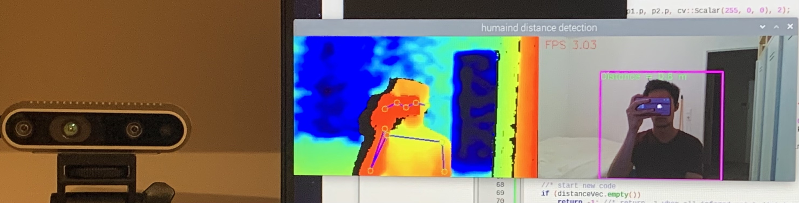

# Humain distance detection

This is a small Realsense project in C++ compiled on a raspberry pi 4. 
The goald of this project is to detect a humain and display their distance from a intelrealsense d435i data stream.

## How

To accomplish this task we simply use a "humain pose" neural network to infere from the realsense color frame and calculate the distance of the infered humain pose by alligned the points/joints of the resulting skeleton to the depth frame.
Finding the mean of those points/joints is a good approximation of the distance of the infered humain.

Remark, this code is not at all optimized :smile:

## Where do the code comme from

The code is mainly a mix of different realsense SDK examples and tutorial adapted to work in a IA "humain pose" inferance example.
The added/modified code to the inerance example is followed by a <code>//* comment</code> or balised by a <code>//* start/end of new code </code>.

The ncnn repository can be found at [Qengineering github](https://github.com/Qengineering/ncnn_Pose_RPi_64-bits). Thank Qengineering!!
Some of the realsense code was directly taken from this realsense SDK [opencv guide](https://github.com/IntelRealSense/librealsense/blob/master/doc/stepbystep/getting_started_with_openCV.md).

## Installation guide

- Tencent ncnn framework was installed using [this guide](https://qengineering.eu/install-ncnn-on-raspberry-pi-4.html).
- The realsense SDK was installed on rasbian following [this support thread](https://support.intelrealsense.com/hc/en-us/community/posts/360048495493--Intel-Realsense-D435-with-RaspberryPi-Best-practice-installation-guide)
